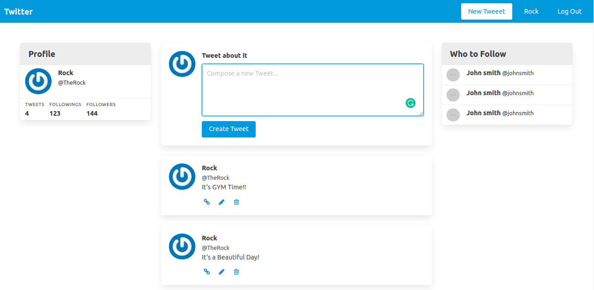

# Twitter Clone
This is the lightweight version of the Twitter clone that focuses on Authentication systems so users can only access areas of a site they are authorized to.



## About the Project

This is a simple Twitter clone project using Ruby on Rails.  This project follows Andy Leverenz’s brilliant Building a Twitter Clone screencasts. The main purpose of this project is to get a lot of healthy experiences with using Devise.

**Devise**
Devise is a flexible authentication solution for Rails based on Warden. It:

- Is Rack based;
- Is a complete MVC solution based on Rails engines;
- Allows you to have multiple models signed in at the same time;
- Is based on a modularity concept: use only what you really need.

### Built With

- [Rails](https://guides.rubyonrails.org/)
- [Ruby](https://www.ruby-lang.org/en/)
- HTML
- [Bulma](https://www.rubydoc.info/gems/bulma/0.1.0)
- [Devise](https://github.com/heartcombo/devise)
- SQLite3


## Getting Started

To get a local copy up and running follow these simple example steps.

1. If you're running the Windows Operating System, open your command prompt. On Linux, Open your terminal.

2. Copy and paste the following code into the Terminal:

   ``` git clone https://github.com/Div685/twitter-demo-app.git ```

3. Press Enter.

4. Once the repository has been cloned, navigate inside the repository

5. After you will need to update and install some of the depedency. Use following command to install the packages
 - `bundle install`
 - `yarn install`
 - `rake db:migrate`

6. once you install the packages and migrate the database you can run the server
 - `rails s` or `rails server`

7. Enjoy


## Contributing

Contributions, issues, and feature requests are welcome!
Feel free to check the [issues page](../../issues).

## Show your support

Give a ⭐️ if you like this project!


## Authors


👤 **Divyesh Patel**

- GitHub: [@Div685](https://github.com/Div685)
- Twitter: [@div_685](https://twitter.com/div_685)
- LinkedIn: [Divyesh Patel](https://www.linkedin.com/in/divyesh-daxa-patel)


## Acknowledgments

- [Ruby-doc](https://ruby-doc.org/core-2.6.5)
- [Rails-doc](https://guides.rubyonrails.org/)